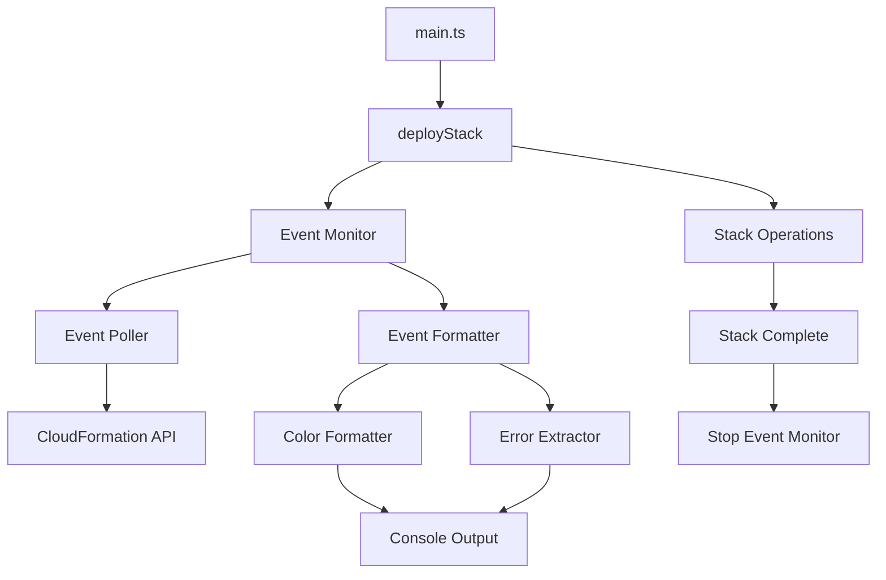

# Design Document: CloudFormation Event Streaming

## Overview

This design enhances the AWS CloudFormation GitHub Deploy Action to provide real-time event streaming during stack deployments. The solution integrates seamlessly with the existing deployment flow by adding event monitoring capabilities that poll CloudFormation stack events and display them with color-coded formatting and clear error messages.

The event streaming system will run concurrently with the existing deployment process, providing immediate feedback to developers without requiring changes to their workflow or configuration.

## Architecture

The event streaming functionality will be implemented as a separate module that integrates with the existing deployment flow. The architecture follows these key principles:

1. **Non-blocking Integration**: Event streaming runs concurrently with deployment operations
2. **Fault Tolerance**: Streaming errors don't affect the core deployment process
3. **Performance Optimization**: Efficient polling with exponential backoff and rate limiting
4. **Backward Compatibility**: Optional feature that doesn't change existing behavior



## Components and Interfaces

### EventMonitor Class

The main orchestrator for event streaming functionality.

```typescript
interface EventMonitorConfig {
  stackName: string
  client: CloudFormationClient
  enableColors: boolean
  pollIntervalMs: number
  maxPollIntervalMs: number
}

class EventMonitor {
  constructor(config: EventMonitorConfig)

  // Start monitoring stack events
  async startMonitoring(): Promise<void>

  // Stop monitoring (called when stack reaches terminal state)
  stopMonitoring(): void

  // Check if monitoring is active
  isMonitoring(): boolean
}
```

### EventPoller Class

Handles the polling logic with exponential backoff and rate limiting.

```typescript
interface StackEvent {
  Timestamp?: Date
  LogicalResourceId?: string
  ResourceType?: string
  ResourceStatus?: string
  ResourceStatusReason?: string
  PhysicalResourceId?: string
}

class EventPoller {
  constructor(client: CloudFormationClient, stackName: string)

  // Poll for new events since last check
  async pollEvents(): Promise<StackEvent[]>

  // Get current polling interval
  getCurrentInterval(): number

  // Reset polling interval (called when new events found)
  resetInterval(): void
}
```

### EventFormatter Class

Formats events for display with colors and structure.

```typescript
interface FormattedEvent {
  timestamp: string
  resourceInfo: string
  status: string
  message?: string
  isError: boolean
}

class EventFormatter {
  constructor(enableColors: boolean)

  // Format a single event for display
  formatEvent(event: StackEvent): FormattedEvent

  // Format multiple events as a batch
  formatEvents(events: StackEvent[]): string
}
```

### ColorFormatter Class

Applies ANSI color codes based on event status.

```typescript
enum EventColor {
  SUCCESS = '\x1b[32m',    // Green
  WARNING = '\x1b[33m',    // Yellow
  ERROR = '\x1b[31m',      // Red
  INFO = '\x1b[34m',       // Blue
  RESET = '\x1b[0m'        // Reset
}

class ColorFormatter {
  // Apply color based on resource status
  colorizeStatus(status: string, text: string): string

  // Apply color for timestamps
  colorizeTimestamp(timestamp: string): string

  // Apply color for resource information
  colorizeResource(resourceType: string, resourceId: string): string

  // Apply bold red formatting for errors
  colorizeError(message: string): string
}
```

### ErrorExtractor Class

Extracts and highlights error messages from stack events.

```typescript
interface ExtractedError {
  message: string
  resourceId: string
  resourceType: string
  timestamp: Date
}

class ErrorExtractor {
  // Extract error information from a stack event
  extractError(event: StackEvent): ExtractedError | null

  // Check if an event represents an error condition
  isErrorEvent(event: StackEvent): boolean

  // Format error message for display
  formatErrorMessage(error: ExtractedError): string
}
```

## Data Models

### Event Status Mapping

```typescript
const STATUS_COLORS = {
  // Success states (Green)
  'CREATE_COMPLETE': EventColor.SUCCESS,
  'UPDATE_COMPLETE': EventColor.SUCCESS,
  'DELETE_COMPLETE': EventColor.SUCCESS,
  'CREATE_IN_PROGRESS': EventColor.SUCCESS,
  'UPDATE_IN_PROGRESS': EventColor.SUCCESS,

  // Warning states (Yellow)
  'UPDATE_ROLLBACK_IN_PROGRESS': EventColor.WARNING,
  'UPDATE_ROLLBACK_COMPLETE': EventColor.WARNING,
  'CREATE_ROLLBACK_IN_PROGRESS': EventColor.WARNING,

  // Error states (Red)
  'CREATE_FAILED': EventColor.ERROR,
  'UPDATE_FAILED': EventColor.ERROR,
  'DELETE_FAILED': EventColor.ERROR,
  'UPDATE_ROLLBACK_FAILED': EventColor.ERROR,
  'CREATE_ROLLBACK_FAILED': EventColor.ERROR
} as const
```

### Event Display Format

```typescript
interface EventDisplayConfig {
  showTimestamp: boolean
  showResourceType: boolean
  showPhysicalId: boolean
  maxResourceNameLength: number
  indentLevel: number
}
```

## Integration Points

### Integration with deployStack Function

The event monitoring will be integrated into the existing `deployStack` function in `deploy.ts`:

```typescript
export async function deployStack(
  cfn: CloudFormationClient,
  params: CreateStackInputWithName,
  changeSetName: string,
  noEmptyChangeSet: boolean,
  noExecuteChangeSet: boolean,
  noDeleteFailedChangeSet: boolean,
  changeSetDescription?: string,
  enableEventStreaming: boolean = true // New parameter
): Promise<string | undefined> {

  let eventMonitor: EventMonitor | undefined

  if (enableEventStreaming) {
    eventMonitor = new EventMonitor({
      stackName: params.StackName,
      client: cfn,
      enableColors: true,
      pollIntervalMs: 2000,
      maxPollIntervalMs: 30000
    })

    // Start monitoring before stack operations
    eventMonitor.startMonitoring().catch(err => {
      core.warning(`Event streaming error: ${err.message}`)
    })
  }

  try {
    // Existing deployment logic...
    const result = await performDeployment(/* ... */)

    return result
  } finally {
    // Stop monitoring when deployment completes
    if (eventMonitor) {
      eventMonitor.stopMonitoring()
    }
  }
}
```

### Integration with main.ts

Add a new optional input parameter for controlling event streaming:

```typescript
// In main.ts run() function
const enableEventStreaming = !!+core.getInput('enable-event-streaming', {
  required: false
}) || true // Default to enabled

const stackId = await deployStack(
  cfn,
  params,
  changeSetName ? changeSetName : `${params.StackName}-CS`,
  noEmptyChangeSet,
  noExecuteChangeSet,
  noDeleteFailedChangeSet,
  changeSetDescription,
  enableEventStreaming // Pass the new parameter
)
```

### Action.yml Updates

Add new input parameter:

```yaml
enable-event-streaming:
  description: >-
    Enable real-time CloudFormation event streaming during deployment.
    Defaults to '1' (enabled). Set to '0' to disable event streaming.
  required: false
  default: 1
```

## Correctness Properties

_A property is a characteristic or behavior that should hold true across all valid executions of a system-essentially, a formal statement about what the system should do. Properties serve as the bridge between human-readable specifications and machine-verifiable correctness guarantees._

### Property 1: Event Monitor Lifecycle

_For any_ stack deployment, when the deployment begins, event monitoring should start immediately and continue until the stack reaches a terminal state, then stop immediately.
**Validates: Requirements 1.1, 1.3, 5.4**

### Property 2: Event Display Timeliness

_For any_ new stack events that become available, they should be displayed within 5 seconds of being available from the CloudFormation API.
**Validates: Requirements 1.2**

### Property 3: Deployment Summary Display

_For any_ completed stack deployment, a final summary of the deployment result should be displayed when the stack reaches a terminal state.
**Validates: Requirements 1.4**

### Property 4: Status Color Mapping

_For any_ stack event with a resource status, the color formatter should apply the correct color based on status type: green for success states (CREATE_COMPLETE, UPDATE_COMPLETE, etc.), yellow for warning states (ROLLBACK statuses), red for error states (FAILED statuses), and blue for informational elements (timestamps, resource names).
**Validates: Requirements 2.1, 2.2, 2.3, 2.4**

### Property 5: Error Message Extraction and Formatting

_For any_ stack event that contains an error, the system should extract the StatusReason field and display it with bold red formatting, with multiple errors clearly separated.
**Validates: Requirements 3.1, 3.2, 3.3**

### Property 6: Complete Error Message Display

_For any_ error message that appears truncated, if the full message is available in the event details, the system should display the complete message.
**Validates: Requirements 3.4**

### Property 7: Structured Event Display

_For any_ stack event, the display should include timestamp in ISO 8601 format with timezone, resource type, resource name, and status in a structured format.
**Validates: Requirements 4.1, 4.2**

### Property 8: Resource Name Truncation

_For any_ stack event with a resource name longer than the maximum display length, the system should truncate the name while maintaining readability.
**Validates: Requirements 4.3**

### Property 9: Nested Resource Indentation

_For any_ stack events representing nested resources, child resource events should be indented appropriately to show hierarchy.
**Validates: Requirements 4.4**

### Property 10: Exponential Backoff Polling

_For any_ event polling session, the polling intervals should follow exponential backoff starting at 2 seconds, increasing when no new events are available, up to a maximum of 30 seconds.
**Validates: Requirements 5.1, 5.3**

### Property 11: API Throttling Handling

_For any_ API throttling response from CloudFormation, the event monitor should respect rate limits and retry with appropriate backoff.
**Validates: Requirements 5.2**

### Property 12: Deployment Functionality Preservation

_For any_ deployment with event streaming enabled, all existing deployment functionality should work exactly as it did without event streaming.
**Validates: Requirements 6.1**

### Property 13: Error Isolation

_For any_ error that occurs in event streaming, the deployment process should continue normally and streaming errors should be logged separately without affecting deployment success/failure.
**Validates: Requirements 6.2**

### Property 14: Original Error Preservation

_For any_ deployment that fails, the original deployment error should be preserved and not masked by any event streaming errors.
**Validates: Requirements 6.3**

### Property 15: Event Streaming Configuration

_For any_ deployment configuration, when event streaming is disabled, the system should function exactly as it did before event streaming was added (backward compatibility).
**Validates: Requirements 6.4**

## Error Handling

### Event Streaming Errors

- Event streaming errors are isolated from deployment errors
- Streaming failures are logged as warnings, not errors
- Deployment continues normally if event streaming fails
- Original deployment errors take precedence over streaming errors

### API Rate Limiting

- Implement exponential backoff for CloudFormation API calls
- Respect AWS API rate limits with appropriate retry logic
- Graceful degradation when API limits are exceeded
- Fallback to less frequent polling if necessary

### Network and Connectivity Issues

- Handle network timeouts gracefully
- Retry failed API calls with exponential backoff
- Continue deployment if event streaming becomes unavailable
- Log connectivity issues as warnings

## Testing Strategy

### Dual Testing Approach

The testing strategy combines unit tests for specific examples and edge cases with property-based tests for universal properties across all inputs.

**Unit Tests:**

- Test specific event formatting examples
- Test color code application for known statuses
- Test error message extraction from sample events
- Test polling interval calculations
- Test integration points with existing deployment flow
- Test configuration option handling

**Property-Based Tests:**

- Generate random stack events and verify formatting consistency
- Generate various resource statuses and verify correct color mapping
- Generate different polling scenarios and verify backoff behavior
- Generate error conditions and verify isolation from deployment
- Test backward compatibility with random configuration combinations

**Property Test Configuration:**

- Use fast-check library for TypeScript property-based testing
- Configure each test to run minimum 100 iterations
- Each property test references its design document property
- Tag format: **Feature: cloudformation-event-streaming, Property {number}: {property_text}**

**Integration Testing:**

- Test event streaming with actual CloudFormation stack operations
- Verify event display during real deployments
- Test error scenarios with failed stack deployments
- Validate performance under various load conditions

**Mock Testing:**

- Mock CloudFormation API responses for consistent testing
- Simulate various event sequences and timing scenarios
- Test edge cases like empty event lists and malformed responses
- Verify proper cleanup and resource management
